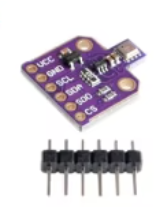
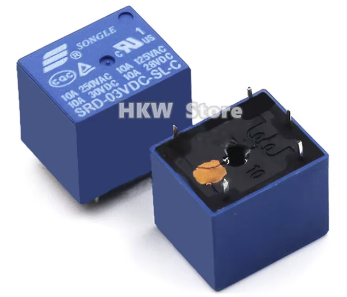
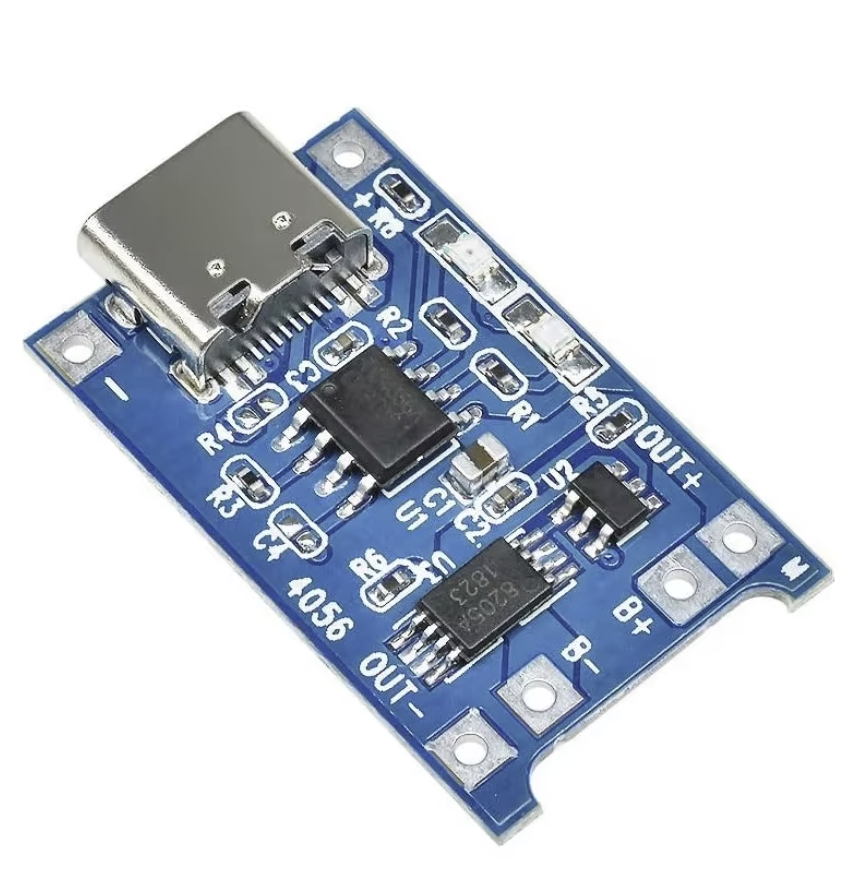
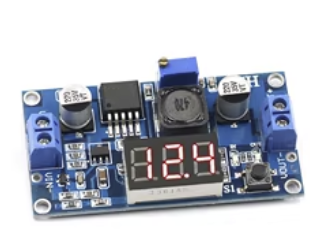

# Electrical Components

| Name | Part number | Qty | Purpose | Notes | Image |
|------|-------------|-----|---------|-------|-------|
| ESP32 NodeMCU D1 Mini module | ESP32 NodeMCU v3/v2 |  | Main MCU (pump/level control) | Entry text was "Wireless module NodeMcu v3 v2 ESP32 D1MINI Lua WIFI development" |  |
| ESP8266 NodeMCU module | ESP8266 CH340G NodeMcu V3 |  | WiFi MCU (if used) |  |  |
| Temperature sensor | DS18B20 (TO-92) |  | Temperature sensing |  |  |
| Env sensor module | BME680 |  | Temperature/humidity/pressure (and gas) | Listed twice in input; kept once |   |
| Env sensor module | BME280 |  | Temperature/humidity/pressure |  |  |
| Relay | SRD-05VDC-SL-C (5VDC) |  | Switching pump or load |  |  |
| Water level sensor | XKC-Y25-V |  | Non-contact water level detection |  |  |
| Water pump | DC 12V 70PSI 3.5L/min |  | Pumping water |  |  |
| Li-ion charger module | TP4056 (5V 1A, USB-C, protected) |  | Charge 18650 cells | "Dual Functions" in input |  |
| DC-DC buck module | MP1584EN (3A adjustable) |  | Step-down supply | Listed as TZT MP1584EN / XM1584 |  |
| DC-DC buck module | LM2596 |  | Step-down supply |  |  |
| DC-DC buck module | XL7015 (5V-80V input) |  | Step-down supply |  |  |
| DC-DC boost module | MT3608 (2A) |  | Step-up supply | 20 pcs kit |  |
| Linear regulator | LM338T (1.2-32V, 5A) |  | Adjustable regulation | 10 pcs |  |
| DC-DC buck module | LM2596S |  | Step-down supply | Separate listing in input |  |
| AC-DC transformer | AC110-220V to 12V 15A |  | Primary power supply | Listed as "vusum Lighting Transformer" |  |
| MOSFET assortment | IRF510/520/530/540/630/640/730/740/830/840 (TO-220) |  | Switching / power control | Assorted kit |  |
| Diode assortment | 1N4001-1N4005 (rectifier kit) |  | Rectification / protection | 200 pcs kit, truncated list in input |  |
| Resistor assortment | 1/4W metal film, 1% (10-1M Ohm) |  | General purpose | 600 pcs kit |  |
| Electrolytic capacitor assortment | 0.1uF-1000uF, 16-50V |  | General purpose | 500 pcs kit; noted price was EUR 7.89 x1 |  |
